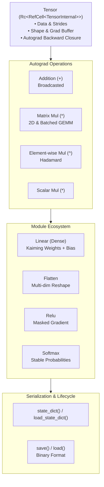

# NeuralNetworksRust 🦀🧠

A lightweight, pure-Rust deep learning framework featuring a dynamic reverse-mode automatic differentiation (autograd) engine, multidimensional tensor operations with broadcasting, modular layer abstractions, and binary model serialization—built from scratch with zero heavy external dependencies.

---

## 🌟 Highlights

- **Dynamic Autograd Engine**: Reverse-mode automatic differentiation building a tape-free, reference-counted computational graph on the fly.
- **Multidimensional Tensor Runtime**: Tensors supporting arbitrary dimensions, strides, matrix multiplications with batched broadcasting, and Kaiming/Xavier initializations.
- **Modular PyTorch-style API**: Hierarchical `Module` trait with sub-module nesting, recursive parameter tracking, state dictionaries, and gradient management.
- **Binary Model Checkpointing**: Custom high-speed binary serialization and deserialization (`.bin` state dict format) for checkpointing and restoring trained models.
- **Zero-Dependency Core**: Pure Rust standard library core—no heavy C/C++ or external BLAS runtime requirements.
- **Rigorously Tested**: Comprehensive black-box unit tests and finite-difference numerical gradient verifications checking analytical backprop accuracy against machine epsilon.

---

## 🏗️ Architecture Overview



---

## 📦 Modules & Layer Ecosystem

| Component | Status | Description |
|---|:---:|---|
| **`Tensor`** | ✅ Available | Dynamic tensor supporting ND shapes, strides, slicing, indexing, and autograd tape. |
| **`Module` Trait** | ✅ Available | Base trait for composable layers, parameter management, and binary state I/O. |
| **`Linear`** | ✅ Available | Dense fully connected layer with Kaiming uniform weights and zero-initialized bias. |
| **`Flatten`** | ✅ Available | Flattens contiguous dimensions while preserving arbitrary batch dimensions. |
| **`Relu`** | ✅ Available | Rectified Linear Unit activation with exact subgradient routing. |
| **`Softmax`** | 🔄 In Progress | Multi-class exponential normalization and Jacobian-vector backprop. |
| **`CrossEntropyLoss`** | ⏳ Planned | Numerically stable negative log-likelihood with integrated LogSoftmax. |
| **`MSELoss`** | ⏳ Planned | Mean squared error loss for regression tasks. |
| **`SGD` Optimizer** | ⏳ Planned | Stochastic gradient descent with momentum and weight decay. |
| **`Adam` / `AdamW`** | ⏳ Planned | Adaptive moment estimation optimizers. |
| **`Conv2d` & `MaxPool2d`** | ⏳ Planned | 2D Spatial convolutions and downsampling for computer vision. |

---

## 🚀 Quick Start

Add `NeuralNetworksRust` to your `Cargo.toml`:

```toml
[dependencies]
NeuralNetworksRust = { path = "." }
```

### 1. Creating Tensors & Autograd

```rust
use NeuralNetworksRust::Tensor;

// Create tensors with gradient tracking
let a = Tensor::new(vec![1.0, 2.0, 3.0, 4.0], vec![2, 2]).with_requires_grad();
let b = Tensor::new(vec![5.0, 6.0, 7.0, 8.0], vec![2, 2]).with_requires_grad();

// Matrix multiplication
let c = &a * &b;

// Element-wise operations and scalar scaling
let loss = &c * 2.0;

println!("Loss shape: {:?}", loss.shape());
```

### 2. Defining a Neural Network

```rust
use NeuralNetworksRust::{Tensor, Module, Flatten, Linear, Relu};

pub struct Net {
    pub flatten: Flatten,
    pub fc1: Linear,
    pub relu: Relu,
    pub fc2: Linear,
}

impl Net {
    pub fn new() -> Self {
        Self {
            flatten: Flatten::new(1, None), // Preserve batch dimension
            fc1: Linear::new(28 * 28, 128),
            relu: Relu::new(),
            fc2: Linear::new(128, 10),
        }
    }
}

impl Module for Net {
    fn forward(&self, x: &Tensor) -> Tensor {
        let x = self.flatten.forward(x);
        let x = self.fc1.forward(&x);
        let x = self.relu.forward(&x);
        self.fc2.forward(&x)
    }

    fn modules(&self) -> Vec<(String, &dyn Module)> {
        vec![
            ("flatten".to_string(), &self.flatten),
            ("fc1".to_string(), &self.fc1),
            ("relu".to_string(), &self.relu),
            ("fc2".to_string(), &self.fc2),
        ]
    }
}

fn main() {
    let model = Net::new();
    
    // Batch of 4 images: [batch_size, height, width]
    let input = Tensor::random(vec![4, 28, 28]);
    let logits = model.forward(&input);

    assert_eq!(logits.shape(), vec![4, 10]);
    println!("Output logits:\n{}", logits);
}
```

### 3. Checkpointing & State Persistence

Save and restore weights using the native binary format:

```rust
// Save trained parameters to disk
model.save("checkpoint.bin").expect("Failed to save model");

// Load parameters into an existing architecture
let restored_model = Net::new();
restored_model.load("checkpoint.bin").expect("Failed to load model");
```

---

## 🧪 Testing & Gradient Verification

The repository enforces high test coverage with **clean-room black-box testing**. Backward gradient passes are mathematically validated using finite differences:

$$\frac{\partial f}{\partial x_i} \approx \frac{f(x + \epsilon e_i) - f(x - \epsilon e_i)}{2\epsilon}$$

Run the test suite:

```bash
cargo test
```

### Test Suite Highlights:
- **`tests/test_add.rs`**: Scalar, broadcasted, and tensor-tensor addition gradient checks.
- **`tests/test_elemmul.rs`**: Element-wise multiplication (`^`) product-rule checks.
- **`tests/test_matmul.rs`**: 1D dot product, 2D matrix multiplication, and higher-order batched matrix multiplication gradients.
- **`tests/test_gradients.rs`**: Complex multi-layer computation graph backward verifications against numerical approximations.

---

## 🐍 Python & MNIST Experiments

The `mnist.ipynb` notebook provides:
- A reference PyTorch model trained on the MNIST and Fashion-MNIST datasets.
- Pre-trained model artifact export (`model.pth`).
- Cross-validation benchmarks between the Rust forward inference pass and PyTorch outputs.

To launch the notebook environment with [uv](https://github.com/astral-sh/uv):

```bash
uv run jupyter lab mnist.ipynb
```

---

## 🗺️ Roadmap & Upcoming Features

- [x] Multidimensional `Tensor` with dynamic shape, strides, and memory layout
- [x] Tape-free reverse-mode automatic differentiation graph
- [x] Operator overloads for Addition (`+`), Matrix Multiplication (`*`), and Hadamard Product (`^`)
- [x] Kaiming and Xavier uniform weight initializations
- [x] `Module` abstraction with recursive parameter registration and state dicts
- [x] Fast binary serialization and deserialization for model checkpoints
- [x] Core layers: `Linear`, `Flatten`, `Relu`
- [ ] Numerically stable `Softmax` and `LogSoftmax`
- [ ] Native loss functions (`CrossEntropyLoss`, `MSELoss`, `NLLLoss`)
- [ ] Native optimizers (`SGD` with momentum, `Adam`, `AdamW`)
- [ ] End-to-end Rust training loop and native MNIST binary dataset reader
- [ ] Convolutional layers (`Conv2d`, `MaxPool2d`, `BatchNorm2d`)
- [ ] Hardware acceleration (SIMD / optional BLAS backends)

---

## 📄 License

Dual-licensed under either of [MIT License](LICENSE-MIT) or [Apache License, Version 2.0](LICENSE-APACHE) at your option.
