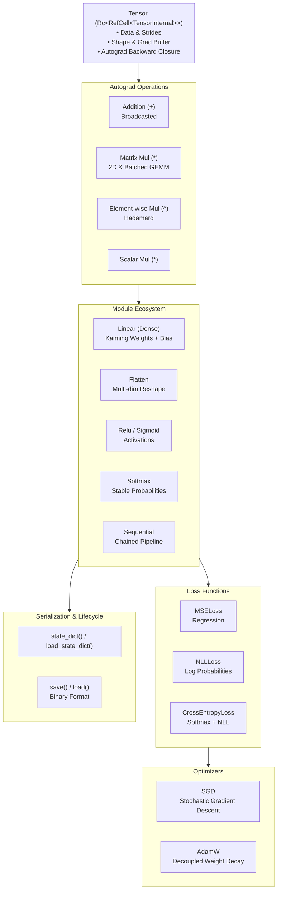

# NeuralNetworksRust 🦀🧠

A lightweight, pure-Rust deep learning framework featuring a dynamic reverse-mode automatic differentiation (autograd) engine, multidimensional tensor operations with broadcasting, modular layer abstractions, loss functions, optimizers, and binary model serialization—built from scratch with zero heavy external dependencies.

---

## 🌟 Highlights

- **Dynamic Autograd Engine**: Reverse-mode automatic differentiation building a tape-free, reference-counted computational graph on the fly.
- **Multidimensional Tensor Runtime**: Tensors supporting arbitrary dimensions, strides, matrix multiplications with batched broadcasting, and Kaiming/Xavier initializations.
- **Modular PyTorch-style API**: Hierarchical `Module` trait with sub-module nesting, `Sequential` container, recursive parameter tracking, state dictionaries, and gradient management.
- **Loss Functions**: Analytical loss functions including `MSELoss`, `NLLLoss`, and `CrossEntropyLoss` (composed seamlessly via `Softmax` + `NLLLoss`).
- **First-Class Optimizers**: Base `Optimizer` trait with `SGD` and modern `AdamW` (with decoupled weight decay).
- **Binary Model Checkpointing**: Custom high-speed binary serialization and deserialization (`.bin` state dict format) for checkpointing and restoring trained models.
- **Zero-Dependency Core**: Pure Rust standard library core—no heavy C/C++ or external BLAS runtime requirements.
- **Rigorously Tested**: Comprehensive black-box unit tests and finite-difference numerical gradient verifications checking analytical backprop accuracy against machine epsilon.

---

## 🏗️ Architecture Overview



---

## 📦 Modules & Component Ecosystem

| Component | Description |
|---|---|
| **`Tensor`** | Dynamic tensor supporting ND shapes, strides, slicing, indexing, and autograd tape. |
| **`Module` Trait** | Base trait for composable layers, parameter management, and binary state I/O. |
| **`Linear`** | Dense fully connected layer with Kaiming uniform weights and zero-initialized bias. |
| **`Flatten`** | Flattens contiguous dimensions while preserving arbitrary batch dimensions. |
| **`Relu`** | Rectified Linear Unit activation with exact subgradient routing. |
| **`Sigmoid`** | Sigmoid activation function. |
| **`Softmax`** | Multi-class exponential normalization and Jacobian-vector backpropagation. |
| **`Sequential`** | Sequential layer container executing forward passes in chained order. |
| **`Loss` Trait** | Base trait for computing training losses. |
| **`MSELoss`** | Mean squared error loss for regression tasks. |
| **`NLLLoss`** | Negative log-likelihood loss supporting class indices, one-hot, and soft distribution targets. |
| **`CrossEntropyLoss`** | Numerically stable multi-class cross entropy composed of Softmax and NLLLoss. |
| **`Optimizer` Trait** | Base trait providing `.step()` and `.zero_grad()` for all optimizers. |
| **`SGD`** | Basic stochastic gradient descent optimizer. |
| **`AdamW`** | Adaptive moment estimation optimizer with decoupled weight decay. |

---

## 🚀 Quick Start

Add `NeuralNetworksRust` to your `Cargo.toml`:

```toml
[dependencies]
NeuralNetworksRust = { path = "." }
```

### 1. Creating Tensors & Autograd

```rust
use NeuralNetworksRust::Tensor;

// Create tensors with gradient tracking
let a = Tensor::new(vec![1.0, 2.0, 3.0, 4.0], vec![2, 2]).with_requires_grad();
let b = Tensor::new(vec![5.0, 6.0, 7.0, 8.0], vec![2, 2]).with_requires_grad();

// Matrix multiplication
let c = &a * &b;

// Element-wise operations and scalar scaling
let loss = &c * 2.0;

println!("Loss shape: {:?}", loss.shape());
```

### 2. Defining a Model with `Sequential`

```rust
use NeuralNetworksRust::{Tensor, Module, Sequential, Flatten, Linear, Relu};

let model = Sequential::new(vec![
    Box::new(Flatten::new(1, None)),
    Box::new(Linear::new(28 * 28, 128)),
    Box::new(Relu::new()),
    Box::new(Linear::new(128, 10)),
]);

let input = Tensor::random(vec![4, 28, 28]);
let logits = model.forward(&input);

assert_eq!(logits.shape(), vec![4, 10]);
```

### 3. Training Step: Loss & Optimization

```rust
use NeuralNetworksRust::{Tensor, Module, Sequential, Linear, CrossEntropyLoss, Loss, AdamW, Optimizer};

let model = Sequential::new(vec![
    Box::new(Linear::new(10, 3)),
]);

let mut optimizer = AdamW::new(model.parameters(), 0.001);
let criterion = CrossEntropyLoss::new();

let x = Tensor::random(vec![4, 10]);
let targets = Tensor::new(vec![0.0, 1.0, 2.0, 0.0], vec![4]); // Class indices

// Zero gradients
optimizer.zero_grad();

// Forward pass
let logits = model.forward(&x);
let loss = criterion.forward(&logits, &targets);

// Backward pass
loss.backward();

// Parameter update
optimizer.step();
```

### 4. Checkpointing & State Persistence

Save and restore weights using the native binary format:

```rust
// Save trained parameters to disk
model.save("checkpoint.bin").expect("Failed to save model");

// Load parameters into an existing architecture
let restored_model = Sequential::new(vec![...]);
restored_model.load("checkpoint.bin").expect("Failed to load model");
```

---

## 🧪 Testing & Gradient Verification

The repository enforces high test coverage with **clean-room black-box testing**. Backward gradient passes are mathematically validated using finite differences:

$$\frac{\partial f}{\partial x_i} \approx \frac{f(x + \epsilon e_i) - f(x - \epsilon e_i)}{2\epsilon}$$

Run the test suite:

```bash
cargo test
```

### Test Suite Highlights:
- **`tests/test_add.rs`**: Scalar, broadcasted, and tensor-tensor addition gradient checks.
- **`tests/test_elemmul.rs`**: Element-wise multiplication (`^`) product-rule checks.
- **`tests/test_matmul.rs`**: 1D dot product, 2D matrix multiplication, and higher-order batched matrix multiplication gradients.
- **`tests/test_gradients.rs`**: Complex multi-layer computation graph backward verifications against numerical approximations.
- **`tests/test_losses.rs`**: Analytical loss checks and numerical gradient validations for `MSELoss`, `NLLLoss`, and `CrossEntropyLoss`.

---

## 🖥️ Interactive Inference Visualizer (`infer.py`)

Run interactive inference using the pure-Rust model with Python visual rendering:

```bash
uv run python infer.py [sample_index]
```

---

## 🐍 Original Python Prototyping (`python_mnist/`)

All original Python prototyping and PyTorch reference artifacts are isolated in `python_mnist/`:
- **`python_mnist/mnist.ipynb`**: Original PyTorch training notebook.
- **`python_mnist/model.pth`**: Pre-trained PyTorch weights.

To launch the reference Jupyter notebook with [uv](https://github.com/astral-sh/uv):

```bash
uv run jupyter lab python_mnist/mnist.ipynb
```

---

## 📄 License

Dual-licensed under either of [MIT License](LICENSE-MIT) or [Apache License, Version 2.0](LICENSE-APACHE) at your option.
